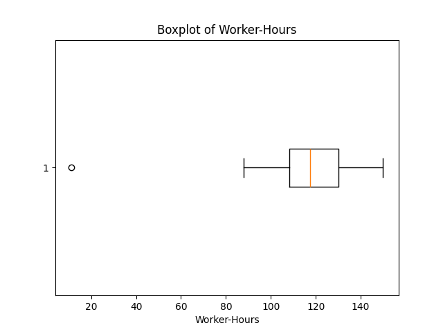

---
runme:
  id: 01HXDFSX9ZK386SWBMTDZ59AX6
  version: v3
---

# Question 4

Industrial engineers periodically conduct “work measurement” analyses to determine the time required to produce a single unit of output. At a large processing plant, the number of total worker-hours required per day to perform a certain task was recorded for 50 days. The data are shown below:

128 119 95 97 124 128 142 98 108 120
113 109 124 132 97 138 133 136 120 112
146 128 103 135 114 109 100 111 131 113
124 131 133 131 88 118 116 98 112 138
100 112 11 150 117 122 97 116 92 122

## Part (a)

Compute the mean, median, and the mode of the data set.

```python {"id":"01HXDFT2E7Z154D74YSEXHG4F1"}
# (a) Compute mean, median
mean = np.mean(data)
median = np.median(data)

# Find mode
unique_values, counts = np.unique(data, return_counts=True)
max_count = np.max(counts)
modes = unique_values[counts == max_count]
```

### Results

```python {"id":"01HXDFPREAR7VQMYBBWGP80GYM"}
Mean: 115.82
Median: 117.5
Mode: [97, 112, 124, 128, 131] (each mode appears 3 times)
```

## Part (b)

Find the range, variance, and standard deviation of the data set.

```python {"id":"01HXDFVVTC2GQC7CGFAXSTGHHV"}
# (b) Calculate range, variance, and standard deviation
data_range = np.ptp(data)
variance = np.var(data, ddof=1)
std_dev = np.sqrt(variance)
```

### Results

```python {"id":"01HXDFPREAR7VQMYBBWHEDM4JZ"}
range_data = 139
variance = 453.17
standard_deviation = 21.29

Results:
Range: 139
Variance: 453.17
Standard Deviation: 21.29
```

## Part (c)

Construct the intervals ± s, ± 2s, and ± 3s. Count the number of observations that fall within each interval and find the corresponding proportions. Do you detect any outliers?

### Code

```python {"id":"01HXDFX5G22BSDMQKHCB9PB3RE"}
# (c) Construct the intervals ±s, ±2s, ±3s
mean_std = mean + np.array([-1, 1]) * std_dev
mean_2std = mean + np.array([-2, 2]) * std_dev
mean_3std = mean + np.array([-3, 3]) * std_dev

# Count the number of observations in each interval
count_s = np.sum((data >= mean_std[0]) & (data <= mean_std[1]))
count_2s = np.sum((data >= mean_2std[0]) & (data <= mean_2std[1]))
count_3s = np.sum((data >= mean_3std[0]) & (data <= mean_3std[1]))

# Proportions for each interval
prop_s = count_s / len(data)
prop_2s = count_2s / len(data)
prop_3s = count_3s / len(data)

# Outliers detection based on ±3s
outliers = data[(data < mean_3std[0]) | (data > mean_3std[1])]
```

### Results

```python {"id":"01HXDFPREAR7VQMYBBWKXK2NJJ"}
intervals = [[94.53, 137.11], [73.24, 158.40], [51.96, 179.68]]
counts = [42, 49, 49]
proportions = [0.84, 0.98, 0.98]
outliers = [11]

Results:
Intervals and counts: ±1s (42), ±2s (49), ±3s (49)
Proportions: ±1s (0.84), ±2s (0.98), ±3s (0.98)
Detected Outliers: [11]
```

## Part (d)

Construct a box plot for the data. Do you detect any outliers?

### CODE

```python {"id":"01HXDFY8QM22RP2QAY06T5GP63"}
# (d) Box plot for the data
plt.boxplot(data, vert=False)
plt.title("Boxplot of Worker-Hours")
plt.xlabel("Worker-Hours")
plt_path = os.path.join("results", "boxplot.png")
create_directory("results")
plt.savefig(plt_path)
plt.close()
```

### Results

```python {"id":"01HXDFPREAR7VQMYBBWMDQFF5F"}
# Placeholder for the box plot image
Box plot analysis detected outliers: [11]
```



## Part (e)

Find the 70th percentile for the data on total daily worker-hours.

### Code

```python {"id":"01HXDG1WYBWMHFBH4GJKJ6KXD7"}
# (e) 70th percentile
percentile_70 = np.percentile(data, 70)
percentile_interpretation = f"70% of the recorded worker-hours are less than or equal to {percentile_70} hours."

```

### Results 

```python {"id":"01HXDFPREAR7VQMYBBWPFK7PEP"}
percentile_70 = 128.0

Results:
70th Percentile: 128.0
```
